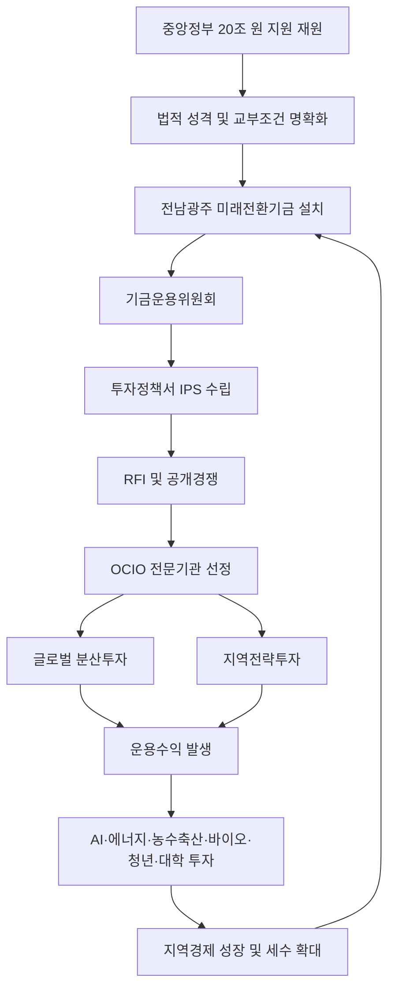
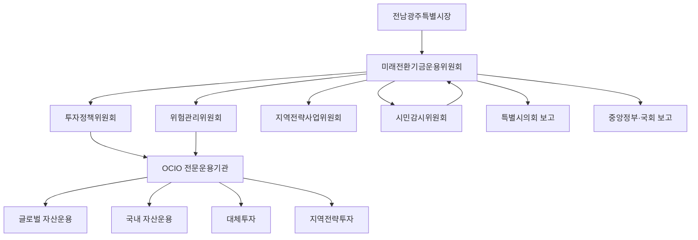

# 전남광주 미래전환기금 조성 및 국민연금식 장기자산배분 벤치마크 운용방안

> **문서 목적**  
> 전남광주특별시 출범에 따른 중앙정부 20조 원 지원 재원을 단기 지출형 예산이 아니라, 장기 성장자본으로 전환하기 위한 정책·법률·금융·설득 전략을 통합 정리한 원본 MD 문서이다.  
> 이 문서는 향후 민형배 당선자, 중앙정부, 국회, 지역주민, 금융기관, 전문운용기관과 논의하기 위한 기초자료이며, 2차 작업에서 VS Code와 Claude를 활용해 세부 보고서·PPT·RFI·조례안으로 확장할 수 있도록 설계하였다.

---

## 0. 핵심 요약

### 0.1 한 문장 제안

전남광주특별시가 중앙정부로부터 지원받는 20조 원 규모 재원은 단기간에 모두 소비하지 말고, 상당 부분을 **전남광주 미래전환기금**으로 제도화하여 국민연금식 장기자산배분 원칙을 벤치마크하고, 미래에셋자산운용 등 공적기금 OCIO 경험이 있는 전문기관을 대상으로 공개경쟁 위탁운용 구조를 설계해야 한다.

### 0.2 핵심 표현

잘못된 표현:

- 국민연금 투자를 그대로 추종한다.
- 국민연금 포트폴리오를 복제한다.
- 미래에셋에 20조 원을 맡긴다.
- 국고지원금을 받아 바로 금융투자한다.

권장 표현:

- 국민연금기금의 장기·분산·위험관리형 자산배분 원칙을 벤치마크한다.
- 국민연금식 중기자산배분 체계를 참고한 전남광주형 참조 포트폴리오를 설계한다.
- 미래에셋자산운용 등 공적기금 OCIO 경험이 있는 전문기관을 대상으로 RFI와 공개경쟁 절차를 추진한다.
- 중앙정부 지원금의 법적 성격과 교부조건에 기금 출연 가능성을 명시한 뒤, 특별법·시행령·조례에 따라 기금을 설치한다.

### 0.3 제안의 본질

이 제안은 단순히 “돈을 투자하자”는 주장이 아니다.  
핵심은 다음 5가지이다.

1. **20조 원을 4년 예산이 아니라 100년 자본으로 전환**
2. **정치적 나눠먹기와 단기 토목사업 중심 집행 방지**
3. **원금 보전과 운용수익 중심 지출을 통한 지속 가능 재원 확보**
4. **국민연금식 장기자산배분 원칙을 벤치마크하되 법적 책임은 독자적으로 설계**
5. **미래에셋 등 OCIO 전문기관을 사전 자문·RFI·공개경쟁 후보군으로 활용**

---

## 1. 배경과 문제의식

### 1.1 전남광주특별시 출범과 20조 원 지원 재원의 의미

전남광주특별시는 행정통합을 통해 광주와 전남의 행정·산업·생활권을 하나의 초광역 단위로 재편하는 역사적 사건이다. 보도에 따르면 통합특별시는 2026년 7월 출범을 목표로 하며, 중앙정부는 4년간 최대 20조 원 규모의 지원을 검토 또는 발표한 것으로 알려져 있다.

이 20조 원은 일반적인 국고보조사업과 다르다.  
단순한 SOC 예산이나 지역개발비가 아니라, 통합특별시의 초기 구조를 결정하는 **초기 자본금** 성격을 가진다.

따라서 다음 질문이 중요하다.

> 20조 원을 4년 안에 쓰고 끝낼 것인가,  
> 아니면 전남광주가 30년, 50년, 100년 동안 활용할 수 있는 지속 가능한 성장자본으로 만들 것인가?

### 1.2 기존 재정투입 방식의 한계

일반적인 대규모 지역재정은 다음 방식으로 쓰이기 쉽다.

| 지출 방식 | 장점 | 한계 |
|---|---|---|
| 도로·철도·청사 등 SOC | 가시적 성과가 빠름 | 정치적 배분, 유지관리비 증가 |
| 산업단지 조성 | 기업 유치 명분 | 미분양·중복투자 위험 |
| 보조금·지원금 | 단기 체감효과 | 지속성 부족 |
| 지역별 숙원사업 배분 | 시군 반발 완화 | 전략성 약화 |
| 행정통합 비용 | 통합 초기 필요 | 미래성장 효과 제한 |

20조 원을 이런 방식으로만 집행하면, 4년 뒤 재원은 사라지고 유지관리비와 정치적 갈등만 남을 수 있다.

### 1.3 기금형 운용의 필요성

기금형 운용은 20조 원을 “예산”에서 “자본”으로 바꾸는 방법이다.

- 예산은 쓰면 사라진다.
- 자본은 운용하면 수익을 낳는다.
- 수익은 다시 지역의 미래사업에 투입될 수 있다.

예를 들어 12조 원을 장기기금으로 적립하고 연 4% 수익률을 달성하면 매년 약 4,800억 원의 운용수익이 발생한다.  
이 수익을 AI, 에너지, 농수축산, 바이오, 모빌리티, 청년정착, 지역대학 혁신 등에 사용하면 중앙정부 지원 종료 이후에도 독자적 성장재원을 확보할 수 있다.

---

## 2. 정책 목표

### 2.1 최상위 목표

> 전남광주특별시의 20조 원 지원 재원을 4년 단기 지출예산이 아니라 100년 지속 가능한 성장자본으로 전환한다.

### 2.2 세부 목표

1. 원금 보전을 원칙으로 하는 장기기금 조성
2. 국민연금식 장기·분산·위험관리 자산배분 원칙 벤치마크
3. OCIO 방식의 전문기관 위탁운용 체계 구축
4. 운용수익을 지역 미래전략사업에 지속 투입
5. 법률·조례·교부조건에 기금 출연 근거 명시
6. 정치적 개입과 특정기관 특혜 논란 차단
7. 중앙정부·국회·지역주민이 수용 가능한 투명한 거버넌스 구축

---

## 3. 용어 정리

### 3.1 국부펀드형 운용

국가 또는 공공기관이 특정 재원을 장기적으로 운용하여 미래세대 또는 공공목적을 위해 활용하는 기금 운용 방식이다. 전남광주특별시의 경우 국가 단위 국부펀드가 아니라 **지방정부형 영구기금** 또는 **지역전략투자기금**으로 보는 것이 적절하다.

### 3.2 국민연금식 장기자산배분

국민연금기금의 실제 포트폴리오를 그대로 복제하는 것이 아니라, 다음 원칙을 참고하는 방식이다.

- 장기 투자기간
- 글로벌 분산투자
- 국내·해외 자산 배분
- 주식·채권·대체투자 조합
- 위험한도 설정
- 중기자산배분 체계
- 직접운용과 위탁운용 병행
- 운용성과 평가와 공시

### 3.3 OCIO

OCIO는 Outsourced Chief Investment Officer의 약자로, 기관투자자가 자산운용의 전략 수립, 자산배분, 위험관리, 성과평가, 운용사 선정 등을 외부 전문기관에 위탁하는 구조를 말한다.

전남광주 미래전환기금은 지방정부가 직접 주식·채권을 운용하는 방식이 아니라, OCIO 구조를 통해 전문기관에 위탁하는 방식이 바람직하다.

### 3.4 RFI

RFI는 Request for Information의 약자로, 공식 입찰 전에 시장의 전문기관으로부터 운용 가능성, 제도 설계, 수수료, 위험관리 방안, 법적 쟁점 등에 대한 정보를 요청하는 절차이다.

RFI는 특정 금융회사를 내정하는 절차가 아니다.  
오히려 공정성과 투명성을 확보하기 위한 사전 시장검증 절차이다.

---

## 4. 전체 구조



---

## 5. 국민연금 직접위탁의 한계와 대안

### 5.1 국민연금 직접위탁이 매력적인 이유

국민연금공단 또는 국민연금기금운용본부는 국내 최고 수준의 장기자산 운용 역량을 가진 공적 기관이다. 따라서 전남광주 미래전환기금 운용에서 국민연금의 전문성을 활용하고 싶다는 구상은 충분히 합리적이다.

국민연금의 장점:

- 대규모 장기자산 운용 경험
- 글로벌 주식·채권·대체투자 역량
- 위험관리 체계
- 운용성과 공시
- 공적 신뢰도
- 장기투자 철학

### 5.2 직접위탁의 법적·제도적 한계

그러나 국민연금에 직접 맡기는 것은 다음 문제가 있다.

| 쟁점 | 내용 |
|---|---|
| 법적 목적 | 국민연금기금은 가입자와 수급자를 위한 기금 |
| 자금 혼합 문제 | 지방정부 자금을 국민연금기금과 섞어 운용하는 것은 부적절 |
| 위탁 근거 | 국민연금공단이 지방정부 자금을 별도 계정으로 수탁 운용할 수 있는 명시적 근거 필요 |
| 책임 구조 | 손실 발생 시 국민연금공단, 지방정부, 중앙정부 간 책임소재 불명확 |
| 정치적 논란 | 국민 노후자금 운용기관을 지역기금에 활용한다는 비판 가능 |

### 5.3 현실적 대안

국민연금 직접위탁이 어렵다면 다음 구조가 더 현실적이다.

1. 국민연금식 장기자산배분 원칙 벤치마크
2. 국민연금공단 또는 기금운용본부 출신 전문가 자문 활용
3. 한국투자공사, 미래에셋자산운용, 삼성자산운용, KB자산운용, NH투자증권, 한국투자신탁운용, 한화자산운용 등 OCIO 경험 기관 대상 RFI
4. 공개경쟁을 통한 OCIO 선정
5. 복수 운용기관 분산 위탁
6. 기금운용위원회가 투자정책서와 위험한도를 통제

---

## 6. 국민연금식 벤치마크 포트폴리오

### 6.1 국민연금 참고 포인트

국민연금 기금운용본부가 공개한 2026년 3월 말 기준 포트폴리오에는 국내주식, 국내채권, 해외주식, 해외채권, 대체투자 등이 포함되어 있으며, 해외투자와 대체투자 비중이 상당한 구조를 보인다.

국민연금 포트폴리오의 핵심 시사점은 다음과 같다.

- 국내 자산에만 투자하지 않는다.
- 해외주식과 해외채권을 적극 활용한다.
- 대체투자를 통해 장기수익 기반을 다변화한다.
- 단기자금 비중은 낮게 유지한다.
- 금융시장 상황에 따라 목표비중을 조정한다.
- 특정 산업이나 특정 지역에 집중하지 않는다.

### 6.2 전남광주형 참조 포트폴리오 기본안

| 자산군 | 기준비중 | 목적 |
|---|---:|---|
| 해외주식 | 35% | 장기 성장 수익 |
| 국내주식 | 10% | 국내 산업 연계 |
| 국내채권 | 20% | 안정성 |
| 해외채권 | 10% | 분산효과 |
| 대체투자 | 15% | 인프라·에너지·부동산·사모 |
| 유동성·단기자금 | 5% | 집행 안정성 |
| 지역전략투자 | 5% | 전남광주 미래산업 연계 |

### 6.3 보수형·중립형·성장형 포트폴리오

| 구분 | 주식 | 채권 | 대체투자 | 유동성 | 지역전략투자 | 특징 |
|---|---:|---:|---:|---:|---:|---|
| 보수형 | 30% | 45% | 10% | 10% | 5% | 원금 안정성 중시 |
| 중립형 | 45% | 30% | 15% | 5% | 5% | 안정성과 성장 균형 |
| 성장형 | 55% | 20% | 15% | 5% | 5% | 장기수익 극대화 |

### 6.4 권장안

초기 5년은 **보수형과 중립형의 중간 구조**가 바람직하다.

- 통합 초기 정치적 논란을 줄여야 함
- 원금 손실 우려를 관리해야 함
- 제도 신뢰를 먼저 확보해야 함
- 이후 성과가 검증되면 성장형으로 일부 전환 가능

---

## 7. 기금 규모 시나리오

### 7.1 8조 원 기금화

| 항목 | 내용 |
|---|---|
| 기금 규모 | 8조 원 |
| 연 3% 수익 | 2,400억 원 |
| 연 4% 수익 | 3,200억 원 |
| 연 5% 수익 | 4,000억 원 |
| 장점 | 정치적 수용성 높음 |
| 단점 | 장기 재원 규모가 상대적으로 작음 |

### 7.2 12조 원 기금화

| 항목 | 내용 |
|---|---|
| 기금 규모 | 12조 원 |
| 연 3% 수익 | 3,600억 원 |
| 연 4% 수익 | 4,800억 원 |
| 연 5% 수익 | 6,000억 원 |
| 장점 | 장기성과와 현실성의 균형 |
| 단점 | 일부 시군에서 직접사업 축소 우려 제기 가능 |

### 7.3 15조 원 기금화

| 항목 | 내용 |
|---|---|
| 기금 규모 | 15조 원 |
| 연 3% 수익 | 4,500억 원 |
| 연 4% 수익 | 6,000억 원 |
| 연 5% 수익 | 7,500억 원 |
| 장점 | 강력한 장기재원 확보 |
| 단점 | 단기 사업 요구와 충돌 가능 |

### 7.4 권장 시나리오

가장 현실적인 안은 **12조 원 기금화 + 8조 원 직접전략투자**이다.

| 구분 | 금액 | 용도 |
|---|---:|---|
| 미래전환기금 | 12조 원 | 원금보전형 장기운용 |
| 미래산업 직접투자 | 4조 원 | AI, 에너지, 반도체, 바이오 |
| 농수축산·지역산업 전환 | 2조 원 | 스마트농업, 스마트축산, 수산가공 |
| 생활·교통·교육·의료 | 1조 원 | 지역균형 생활기반 |
| 행정통합·디지털전환 | 1조 원 | 통합행정, 데이터플랫폼 |

---

## 8. 미래에셋 등 OCIO 기관 접촉 전략

### 8.1 미래에셋 접촉의 타당성

미래에셋자산운용은 주택도시기금 OCIO 등 공적기금 운용·관리 경험이 있는 기관으로 알려져 있다. 따라서 전남광주 미래전환기금의 초기 설계 단계에서 미래에셋과 접촉하는 것은 타당하다.

다만 다음 원칙을 반드시 지켜야 한다.

- 미래에셋을 사전에 운용사로 내정하지 않는다.
- 미래에셋은 RFI 대상 후보군 중 하나로 둔다.
- 삼성, KB, NH, 한국투자, 한화 등 다른 기관도 함께 검토한다.
- 공정한 공개경쟁 절차를 전제로 한다.
- 특정 기업 특혜 논란을 차단한다.

### 8.2 접촉의 목적

미래에셋과의 1차 접촉 목적은 다음과 같다.

1. 지방정부형 장기기금 운용 가능성 확인
2. 8조·12조·15조 원 규모 OCIO 구조 검토
3. 국민연금식 장기자산배분 벤치마크 가능성 검토
4. 원금보전 원칙과 목표수익률의 균형 검토
5. 대체투자·지역전략투자 비중 검토
6. 법적·제도적 쟁점 확인
7. 수수료·성과평가·리스크관리 구조 확인

### 8.3 접촉 시 사용할 문장

> 전남광주특별시 출범에 따른 중앙정부 지원 재원을 단기 지출하지 않고, 장기 미래전환기금으로 조성하는 방안을 검토하고 있습니다. 국민연금기금의 장기자산배분 원칙을 벤치마크하되, 실제 운용은 공적기금 OCIO 경험이 있는 전문기관을 대상으로 공개경쟁 방식으로 검토할 예정입니다. 미래에셋자산운용의 주택도시기금 OCIO 경험을 바탕으로 지방정부형 장기기금 설계 가능성에 대해 사전 의견을 듣고자 합니다.

---

## 9. 법률적 쟁점

### 9.1 가장 중요한 법률 리스크

20조 원이 중앙정부 보조금 또는 교부금 성격으로 지급되는 경우, 이를 곧바로 금융투자기금에 적립하면 **용도 외 사용** 문제가 발생할 수 있다.

따라서 핵심은 다음이다.

> 중앙정부 지원금의 법적 성격과 교부조건에 “전남광주 미래전환기금 출연 가능성”을 명시해야 한다.

### 9.2 필요한 법적 근거

| 단계 | 필요한 조치 |
|---|---|
| 특별법 | 기금 설치 및 중앙정부 지원금 출연 근거 |
| 시행령 | 기금 운용, 위탁, 지출, 감독 기준 |
| 조례 | 기금의 목적, 재원, 운용, 위원회, 공시, 감사 |
| 교부조건 | 지원금의 기금 출연 가능성 명시 |
| 투자정책서 | 자산배분, 위험한도, 지출률, 성과평가 기준 |

### 9.3 법률상 주의할 표현

피해야 할 표현:

- 중앙정부 보조금을 투자한다.
- 지원금을 금융상품에 넣는다.
- 국민연금 포트폴리오를 복제한다.
- 미래에셋에 위탁한다.

권장 표현:

- 중앙정부 지원금의 전부 또는 일부를 법령과 교부조건에 따라 기금에 출연한다.
- 기금은 원금 안정성, 장기수익성, 공공성, 지역경제 파급효과를 고려하여 운용한다.
- 기금 운용은 공개경쟁 절차를 통해 선정된 전문기관에 위탁할 수 있다.
- 국민연금식 장기자산배분 원칙은 참조 모델로 활용한다.

---

## 10. 특별법 개정 조문 초안

### 제○조 전남광주 미래전환기금의 설치

① 전남광주통합특별시는 통합특별시의 장기발전, 미래산업 육성, 지역균형발전, 인구정착 및 미래세대 지원을 위하여 전남광주 미래전환기금을 설치할 수 있다.

② 국가는 제1항의 기금 설치 및 운용에 필요한 재원을 예산의 범위에서 지원할 수 있다.

③ 통합특별시장은 국가로부터 지원받은 재정지원금의 전부 또는 일부를 관계 법령과 교부조건에 따라 기금에 출연할 수 있다.

④ 기금은 원금의 안정성, 장기수익성, 공공성 및 지역경제 파급효과를 고려하여 운용하여야 한다.

⑤ 통합특별시장은 기금의 효율적 운용을 위하여 대통령령 또는 조례로 정하는 바에 따라 전문투자기관에 기금의 운용을 위탁할 수 있다.

⑥ 기금의 설치, 존속기한, 재원, 운용, 수익금 사용, 위험관리, 성과평가, 외부감사 및 정보공개에 관한 사항은 조례로 정한다.

---

## 11. 시행령 조문 초안

### 제○조 미래전환기금의 운용

① 통합특별시장은 기금의 안정적 운용을 위하여 중장기 투자정책서를 수립하여야 한다.

② 투자정책서에는 다음 각 호의 사항이 포함되어야 한다.

1. 기금의 운용 목적
2. 목표수익률
3. 허용위험한도
4. 자산군별 기준비중 및 허용범위
5. 지출률 및 재투자율
6. 전문기관 위탁 기준
7. 위험관리 기준
8. 성과평가 및 공시 기준
9. 이해충돌 방지 기준

③ 통합특별시장은 기금 운용의 전문성 확보를 위하여 공개경쟁 절차에 따라 전문운용기관을 선정할 수 있다.

④ 통합특별시장은 기금 운용성과와 위험관리 현황을 매년 특별시의회에 보고하고, 주민에게 공개하여야 한다.

---

## 12. 조례안 핵심 구조

### 전남광주 미래전환기금 설치 및 운용 조례

#### 제1조 목적

이 조례는 전남광주통합특별시의 장기발전과 미래세대 지원을 위하여 전남광주 미래전환기금을 설치하고, 그 관리·운용에 필요한 사항을 규정함을 목적으로 한다.

#### 제2조 기금의 재원

기금은 다음 재원으로 조성한다.

1. 국가 지원금 중 기금 출연 가능 재원
2. 통합특별시 일반회계 또는 특별회계 전입금
3. 기금 운용수익금
4. 기부금 및 출연금
5. 그 밖에 조례로 정하는 수입금

#### 제3조 기금의 용도

기금은 다음 사업에 사용한다.

1. AI, 에너지, 반도체, 바이오, 모빌리티 등 미래산업 육성
2. 스마트농업, 스마트축산, 수산가공, 식품바이오 등 지역산업 고도화
3. 청년정착, 인재양성, 지역대학 혁신
4. 탄소중립, RE100 산업단지, 해상풍력, 그린수소
5. 지역균형발전 및 시군별 전략사업
6. 기타 미래전환기금운용위원회가 필요하다고 인정하는 사업

#### 제4조 원금보전 원칙

① 기금의 원금은 원칙적으로 보전한다.  
② 기금 원금의 사용은 재난, 경제위기, 국가적 위기, 특별시의회 재적의원 3분의 2 이상 동의 등 예외적 경우에 한정한다.

#### 제5조 운용수익의 사용

① 기금 지출은 원칙적으로 운용수익 범위 내에서 한다.  
② 연간 지출액은 최근 3년 평균 기금 평가액의 일정 비율을 초과할 수 없다.  
③ 구체적 지출률은 투자정책서에서 정한다.

#### 제6조 전문기관 위탁

① 시장은 기금 운용의 전문성과 효율성을 위하여 공개경쟁 절차를 거쳐 전문운용기관에 기금 운용을 위탁할 수 있다.  
② 전문운용기관 선정 기준에는 운용경험, 위험관리 능력, 공적기금 운용 경험, 수수료, 이해충돌 방지체계, 지역전략투자 역량을 포함한다.

#### 제7조 정보공개와 감사

① 시장은 기금 운용현황, 수익률, 위험관리 현황, 지출내역을 매년 공개하여야 한다.  
② 기금은 외부감사를 받아야 한다.  
③ 감사 결과는 특별시의회와 주민에게 공개한다.

---

## 13. 기금 거버넌스

### 13.1 조직 구조



### 13.2 위원회 구성

| 위원회 | 역할 |
|---|---|
| 미래전환기금운용위원회 | 최고 의사결정 |
| 투자정책위원회 | 자산배분, 목표수익률, 운용정책 |
| 위험관리위원회 | VaR, 손실한도, 유동성, 환위험 관리 |
| 지역전략사업위원회 | 수익금 사용사업 심사 |
| 시민감시위원회 | 투명성, 이해충돌, 정치적 개입 감시 |
| 외부감사인 | 회계·운용 적정성 검토 |

### 13.3 정치적 개입 차단 장치

1. 투자정책서 사전 공시
2. 자산군별 허용범위 설정
3. 특정 기업 직접투자 제한
4. 지역전략투자는 별도 심사
5. 위원 명단과 회의록 공개
6. 외부감사 의무화
7. 의회 보고 의무화
8. 이해충돌 신고 의무화
9. 운용기관 공개경쟁 선정
10. 성과평가 결과 공개

---

## 14. 운용 원칙

### 14.1 원금보전 원칙

전남광주 미래전환기금은 원금 사용을 금지하거나 극도로 제한해야 한다.  
원금은 미래세대의 자산이며, 현재 세대는 운용수익만 사용하는 구조가 바람직하다.

### 14.2 장기분산 원칙

특정 국가, 특정 산업, 특정 자산군에 집중하지 않는다.  
국내외 주식, 국내외 채권, 대체투자, 유동성 자산으로 분산한다.

### 14.3 수익사용 원칙

기금 수익은 다음 방식으로 배분한다.

| 항목 | 비율 예시 |
|---|---:|
| 미래전략사업 지출 | 60% |
| 재투자 | 30% |
| 위험준비금 | 10% |

### 14.4 지출상한 원칙

연간 지출은 장기 기대수익률 범위 안에서 제한한다.  
노르웨이 GPFG와 유사하게 3% 내외의 지출률을 참고할 수 있다.

### 14.5 공공성과 수익성의 이중 목표

아일랜드 전략투자기금처럼 전남광주 미래전환기금도 다음 두 가지 목표를 동시에 추구해야 한다.

1. 재무적 수익률
2. 지역경제 파급효과

이를 **전남광주형 Double Bottom Line**이라고 부를 수 있다.

---

## 15. 지역전략투자 분야

### 15.1 AI

- 광주 AI 집적단지 고도화
- 공공 AI 실증사업
- AI 기반 행정혁신
- AI 반도체·데이터센터·클라우드 연계
- 지역대학 AI 인재양성

### 15.2 에너지

- 해상풍력
- 그린수소
- RE100 산업단지
- 에너지저장장치
- 전력망·마이크로그리드
- 에너지 데이터 플랫폼

### 15.3 반도체·전력반도체

- 전력반도체
- 패키징
- 소재·부품·장비
- AI 반도체 테스트베드
- 반도체 인력양성

### 15.4 농수축산

- 스마트팜
- 스마트축산
- 한우·낙농·양돈·양계 디지털 관리
- 농산물 유통 데이터 플랫폼
- 식품가공 자동화
- 수산물 고부가가치화

### 15.5 바이오·헬스케어

- 고령친화산업
- 식품바이오
- 헬스케어 데이터
- 지역 의료인프라 고도화
- 바이오소재

### 15.6 모빌리티·공간정보

- 자율주행 실증
- 정밀도로지도
- 드론물류
- 해양·농촌형 모빌리티
- 공간정보 데이터허브

### 15.7 청년·대학·인재

- 지역대학 연구펀드
- 박사급 인재 정착지원
- 청년창업펀드
- 창업주거 패키지
- 산학연 공동연구소

---

## 16. 이해당사자별 설득 논리

### 16.1 민형배 당선자용

핵심 메시지:

> 20조 원은 시장 임기 중 성과를 내기 위한 단기 예산이 아니라, 전남광주특별시 100년을 설계하는 초기 자본입니다.  
> 12조 원만 미래전환기금으로 묶어도 매년 4,000억~5,000억 원대의 전략재원이 생깁니다.  
> 이는 중앙정부 지원 종료 이후에도 전남광주가 스스로 미래산업과 청년정착, 농수축산 혁신을 추진할 수 있는 독립재정 기반입니다.

설득 포인트:

- 20조 원 기획을 제도화하는 구체적 수단
- 임기 성과와 미래세대 책임의 균형
- 정치적 나눠먹기 방지
- 중앙정부와 국회가 수용하기 쉬운 책임재정 모델
- 전남광주 주도성장의 상징 정책

### 16.2 중앙정부용

핵심 메시지:

> 전남광주 미래전환기금은 중앙정부 예산을 지방에 단순 이전하는 방식이 아니라, 국가균형발전 재정을 지속 가능한 성장자본으로 전환하는 제도혁신입니다.

설득 포인트:

- 예산낭비 방지
- 지방재정 책임성 강화
- 국가균형발전 모델화
- 향후 다른 초광역 통합 사례의 표준모델
- 중앙정부 TF가 관리하기 쉬운 구조

### 16.3 국회용

핵심 메시지:

> 20조 원이라는 대규모 재정지원은 강한 통제장치가 필요합니다. 기금형 모델은 원금보전, 지출상한, 외부감사, 의회보고, 정보공개를 통해 단기 선심성 지출보다 국회가 통제하기 쉬운 구조입니다.

설득 포인트:

- 보조금 용도 외 사용 논란 사전 차단
- 특별법·시행령·조례에 근거 명시
- 성과평가와 공시
- 지역 간 형평성 확보
- 정치적 개입 방지

### 16.4 지역주민용

핵심 메시지:

> 20조 원을 한 번 나눠 쓰면 끝납니다. 그러나 기금으로 만들면 매년 돌아오는 지역발전 재원이 됩니다.

설득 포인트:

- 원금을 지키면 다음 세대도 혜택
- 시군별 전략사업을 매년 지원 가능
- 특정 지역 독식 방지
- 청년·농어업·의료·교육에 지속 투자
- 광주와 전남의 상생 구조

### 16.5 금융기관용

핵심 메시지:

> 전남광주 미래전환기금은 국내 최초급 지방정부형 대규모 장기 OCIO 모델입니다. 공적기금 운용 경험이 있는 전문기관의 자산배분·위험관리·성과평가 역량이 필요합니다.

설득 포인트:

- 8조~12조 원 규모의 장기기금
- 국민연금식 자산배분 벤치마크
- 지역전략투자와 글로벌 분산투자 결합
- 공개경쟁 기반 공정한 참여기회
- 국내 OCIO 시장의 대표 사례 가능성

---

## 17. 예상 반론과 답변

### 반론 1. 당장 쓸 곳이 많은데 왜 돈을 묶어두는가?

답변:

전액을 묶자는 것이 아니다. 20조 원 중 일부는 직접투자하고, 일부는 미래전환기금으로 남기자는 것이다. 12조 원을 기금화하고 8조 원을 직접투자하면 현재와 미래를 동시에 잡을 수 있다.

### 반론 2. 투자하다 손실이 나면 어떻게 할 것인가?

답변:

손실 위험은 존재한다. 그래서 직접 운용하지 않고, 전문기관 위탁, 분산투자, 위험한도, 외부감사, 지출상한을 제도화해야 한다. 반대로 20조 원을 단기 사업에 모두 쓰면 사라지는 것은 확정적이다.

### 반론 3. 국민연금에 맡길 수 없다면 이 구상은 불가능한가?

답변:

아니다. 국민연금에 직접 맡기지 않아도 국민연금식 장기자산배분 원칙을 벤치마크할 수 있다. 실제 운용은 미래에셋 등 공적기금 OCIO 경험이 있는 기관을 대상으로 공개경쟁하면 된다.

### 반론 4. 미래에셋에 특혜를 주는 것 아닌가?

답변:

미래에셋을 운용사로 내정하는 것이 아니다. 미래에셋은 공적기금 OCIO 경험을 가진 후보군 중 하나로 RFI 대상이 될 수 있다. 삼성, KB, NH, 한국투자, 한화 등 복수기관을 대상으로 공개경쟁해야 한다.

### 반론 5. 국고지원금을 투자에 쓰는 것은 불법 아닌가?

답변:

교부조건에 기금 출연이 명시되지 않으면 문제가 될 수 있다. 따라서 특별법·시행령·조례·교부조건에 기금 출연과 위탁운용 근거를 사전에 명확히 넣어야 한다.

### 반론 6. 지역경제에 직접 쓰는 것이 더 효과적이지 않은가?

답변:

직접투자도 필요하다. 그러나 모든 재원을 직접투자로 쓰면 단기성과는 있어도 지속성이 없다. 기금형 모델은 매년 반복 가능한 재원을 만들어 직접투자를 지속 가능하게 한다.

### 반론 7. 금융시장이 나빠지면 수익이 없을 수 있다.

답변:

그래서 1년 단위가 아니라 10년 이상 장기평균 수익률을 기준으로 해야 한다. 지출도 단년도 수익이 아니라 최근 3~5년 평균 평가액 또는 평균 수익을 기준으로 제한해야 한다.

---

## 18. RFI 초안: 미래에셋 등 OCIO 후보군 대상

### 18.1 제목

전남광주 미래전환기금 조성 및 장기자산배분 운용모델 검토를 위한 정보제공요청서

### 18.2 배경

전남광주특별시는 통합특별시 출범에 따라 중앙정부 지원 재원의 일부를 장기 미래전환기금으로 조성하는 방안을 검토하고 있다. 본 RFI는 공적기금 OCIO 경험이 있는 전문기관을 대상으로 기금 운용 가능성, 자산배분, 위험관리, 지배구조, 수수료, 법적 쟁점에 관한 시장 의견을 수렴하기 위한 것이다.

본 RFI는 공식 입찰이나 운용기관 선정 절차가 아니며, 특정 기관에 대한 우선권 또는 권리를 부여하지 않는다.

### 18.3 기관 경험 관련 질문

1. 귀사는 공적기금, 연기금, 공공기관 여유자금, 대학기금, 재단기금 등 OCIO 운용 경험을 보유하고 있는가?
2. 운용 규모, 기간, 자산군, 성과평가 방식은 어떠한가?
3. 장기기금 운용에서 귀사의 차별적 강점은 무엇인가?
4. 위험관리와 성과평가를 담당하는 독립 조직이 있는가?
5. 공공기금 운용에서 이해충돌 방지 장치는 무엇인가?

### 18.4 전남광주 미래전환기금 구조 관련 질문

1. 8조 원, 12조 원, 15조 원 규모의 지방정부형 장기기금 운용이 가능한가?
2. 원금보전 원칙과 장기수익률 목표를 동시에 달성하기 위한 구조는 무엇인가?
3. 국민연금식 중기자산배분 체계를 지방정부 기금에 적용할 수 있는가?
4. 목표수익률과 허용위험한도는 어느 수준이 적정한가?
5. 초기 5년의 권장 자산배분은 무엇인가?

### 18.5 자산배분 관련 질문

1. 국내주식, 해외주식, 국내채권, 해외채권, 대체투자, 유동성 자산의 적정 비중은?
2. 대체투자 비중은 어느 정도가 적절한가?
3. 환헤지 정책은 어떻게 설계해야 하는가?
4. 금리상승·주가하락·환율변동 시 위험관리 방안은?
5. ESG 또는 책임투자 원칙을 적용할 수 있는가?

### 18.6 지역전략투자 관련 질문

1. 전체 기금 중 지역전략투자 비중은 어느 정도가 적정한가?
2. AI, 에너지, 농수축산, 바이오, 모빌리티, 공간정보 분야 투자 가능성은?
3. 지역전략투자와 재무수익률 간 충돌을 어떻게 관리할 수 있는가?
4. 지역기업 직접투자와 펀드출자 방식 중 무엇이 바람직한가?
5. 지역전략투자의 성과지표는 어떻게 설계해야 하는가?

### 18.7 법률·제도 관련 질문

1. 지방정부형 장기기금 설치 시 필요한 법적 근거는 무엇인가?
2. 특별법, 시행령, 조례, 교부조건에 반드시 들어가야 할 조항은?
3. 국고지원금을 기금화할 경우 감사·보조금법상 쟁점은?
4. 기금 원금 사용 제한을 어떻게 제도화해야 하는가?
5. 외부감사와 정보공개 범위는 어느 수준이 적정한가?

### 18.8 수수료와 성과평가 관련 질문

1. 8조~12조 원 규모 OCIO 운용 시 수수료 체계는?
2. 고정수수료와 성과보수의 적정 조합은?
3. 성과평가 벤치마크는 어떻게 구성해야 하는가?
4. 운용기관 교체 기준은 무엇이 적정한가?
5. 장기성과와 단기성과를 어떻게 구분 평가해야 하는가?

---

## 19. 추진 로드맵

### 19.1 1단계: 정책 개념 정립

기간: 즉시~1개월

주요 작업:

- 전남광주 미래전환기금 기본구상 작성
- 8조·12조·15조 시나리오 비교
- 국민연금식 벤치마크 모델 정리
- 미래에셋 등 OCIO 기관 접촉 논리 정리
- 민형배 당선자 보고용 1페이지·3페이지 자료 작성

### 19.2 2단계: 법률 검토와 제도 설계

기간: 1~2개월

주요 작업:

- 특별법 개정 필요성 검토
- 시행령·조례안 초안 작성
- 보조금법·지방재정법·지방기금 관련 검토
- 교부조건 문구 작성
- 외부 법률자문 의뢰

### 19.3 3단계: RFI 실시

기간: 2~3개월

대상 후보군:

- 미래에셋자산운용
- 삼성자산운용
- KB자산운용
- 한국투자신탁운용
- NH투자증권
- 한화자산운용
- 국내외 OCIO 전문기관
- 한국투자공사 관련 자문 가능기관
- 국민연금공단 또는 국민연금 출신 전문가 자문그룹

### 19.4 4단계: 정책보고서 확정

기간: 3~4개월

산출물:

- 정책요약서
- 본보고서
- 법률 조문안
- 조례안
- RFI 결과분석
- 운용기관 선정기준
- 기금 투자정책서 초안

### 19.5 5단계: 정치·입법 추진

기간: 4~6개월

주요 작업:

- 민형배 당선자 캠프 또는 인수조직 보고
- 중앙정부 TF 협의
- 국회 상임위·예결위 설득
- 지역 언론 브리핑
- 시민공론화
- 조례 제정 준비

---

## 20. 하네스 엔지니어링 관점의 정책 설계

### 20.1 하네스 엔지니어링의 적용 의미

하네스 엔지니어링은 복잡한 시스템이 임의로 작동하지 않도록 목적, 경계, 검증, 피드백, 제한조건을 설계하는 접근이다. 이 개념을 전남광주 미래전환기금에 적용하면, 기금은 단순한 금융상품이 아니라 **정치적 유혹과 재정낭비를 막는 제도적 하네스**가 된다.

### 20.2 정책 하네스 구성

| 하네스 요소 | 전남광주 미래전환기금 적용 |
|---|---|
| 목적 | 20조 원을 100년 성장자본으로 전환 |
| 경계 | 원금 임의 사용 금지 |
| 허용 행위 | 분산투자, 위탁운용, 수익금 전략사업 투입 |
| 금지 행위 | 선거성 현금지원, 정치적 나눠먹기, 특정 기업 특혜 |
| 검증 | 외부감사, 성과평가, 의회 보고 |
| 피드백 | 수익률 하락 시 지출률 조정 |
| 투명성 | 운용성과와 지출내역 공개 |
| 책임 | 기금운용위원회와 전문기관 역할 분리 |

### 20.3 정책 하네스 흐름


---

## 21. 성과지표

### 21.1 금융성과 지표

| 지표 | 내용 |
|---|---|
| 연평균 수익률 | 3년, 5년, 10년 기준 |
| 변동성 | 자산가치 변동폭 |
| 최대손실률 | 특정 기간 최대 낙폭 |
| 샤프비율 | 위험 대비 수익 |
| 벤치마크 대비 성과 | 기준 포트폴리오 대비 초과수익 |
| 유동성 비율 | 긴급 지출 가능성 |

### 21.2 지역성과 지표

| 지표 | 내용 |
|---|---|
| 청년 순유입 | 20~39세 인구 이동 |
| 지역 GRDP 증가 | 산업별 부가가치 |
| 창업기업 수 | 기술창업·농식품창업 |
| 고용창출 | 직접·간접 고용 |
| 지역대학 연구성과 | 논문, 특허, 기술이전 |
| 농수축산 생산성 | 스마트화, 부가가치 |
| 에너지 자립도 | 재생에너지 비중 |
| 민간투자 유치 | 기금 출자 대비 민간 매칭 |

### 21.3 재정성과 지표

| 지표 | 내용 |
|---|---|
| 자체재원 증가 | 지방세·세외수입 |
| 중앙정부 의존도 | 국고보조 비중 변화 |
| 재정승수 | 기금 지출 대비 경제효과 |
| 유지관리비 부담 | SOC 중심 지출 대비 절감 |
| 수익재투자율 | 운용수익 중 재투자 비중 |

---

## 22. 문서화해야 할 추가 산출물

이 MD 파일을 기반으로 다음 산출물을 만들 수 있다.

### 22.1 정책자료

1. 1페이지 핵심 제안서
2. 3페이지 요약보고서
3. 20페이지 PPT
4. 50페이지 본보고서
5. 민형배 당선자 보고자료
6. 중앙정부 TF 설명자료
7. 국회 입법지원자료
8. 지역주민 설명자료

### 22.2 법률자료

1. 특별법 개정안
2. 시행령 개정안
3. 조례안
4. 교부조건 문구
5. 기금 투자정책서
6. 운용기관 선정기준
7. 이해충돌 방지규정
8. 정보공개 기준

### 22.3 금융자료

1. 자산배분 모델
2. 위험관리 체계
3. 벤치마크 지수 설계
4. 지출률 시뮬레이션
5. 8조·12조·15조 시나리오
6. OCIO 수수료 구조
7. RFI 문서
8. 운용기관 평가표

---

## 23. Claude / VS Code 작업지시서

아래 프롬프트를 VS Code에서 Claude에게 그대로 입력하여 2차 작업을 수행할 수 있다.

```markdown
# 작업지시서: 전남광주 미래전환기금 및 국민연금식 장기자산배분 벤치마크 운용모델 설계

## 역할
당신은 공공기금 설계, OCIO 위탁운용, 지방재정, 특별법 입법, 장기자산배분 전략에 능통한 정책·금융·법률 리서치 어시스턴트다.

## 작업 목표
전남광주특별시가 2026년 7월 출범하면서 중앙정부로부터 지원받을 것으로 예상되는 20조 원 규모 재원을 단기 지출하지 않고, 일부 또는 상당 부분을 “전남광주 미래전환기금”으로 조성하여 장기 운용하는 정책자료를 작성한다.

국민연금에 직접 위탁하지 못하는 경우를 대비하여, 국민연금기금의 장기자산배분 원칙을 벤치마크하고, 미래에셋자산운용 등 공적기금 OCIO 경험이 있는 전문기관을 통해 운용모델을 설계하는 방안을 포함한다.

## 반드시 포함할 핵심 관점
1. 국민연금 직접위탁의 한계
2. 국민연금식 장기자산배분 벤치마크 가능성
3. “추종”이 아니라 “벤치마크” 또는 “참조 포트폴리오”라는 표현 사용
4. 미래에셋을 특정 운용사로 내정하지 말고, RFI 및 공개경쟁 후보군 중 하나로 표현
5. 지방자치단체 기금관리기본법, 보조금 관리에 관한 법률, 지방재정법, 전남광주통합특별법 관련 쟁점 검토
6. OCIO 구조, 기금운용위원회, 위험관리위원회, 외부감사, 성과공시 체계 설계
7. 노르웨이 GPFG, 알래스카 영구기금, 아일랜드 ISIF, 국내 주택도시기금 OCIO 사례 비교
8. 민형배 당선자, 중앙정부, 국회, 지역주민, 금융기관별 설득논리 작성
9. 8조, 12조, 15조 기금화 시나리오별 수익·위험·정치적 수용성 비교
10. 미래에셋 등 금융기관에 보낼 RFI 문서 초안 작성

## 산출물 형식
다음 파일들을 Markdown으로 작성하라.

1. `01_policy_brief.md`
   - 5페이지 내외 정책요약
   - 핵심 메시지, 배경, 제안, 기대효과, 법적 쟁점

2. `02_full_report.md`
   - 40~60페이지 분량의 본보고서
   - 법률, 금융, 해외사례, 국내사례, 운용구조, 로드맵 포함

3. `03_rfi_to_miraeasset_and_ocio_candidates.md`
   - 미래에셋자산운용, 삼성자산운용, 한국투자신탁운용, NH투자증권, KB자산운용 등 OCIO 후보군에게 보낼 RFI 초안

4. `04_legal_clause_draft.md`
   - 특별법 개정 조문
   - 시행령 조문
   - 전남광주 미래전환기금 설치 및 운용 조례안

5. `05_stakeholder_pitch.md`
   - 민형배 당선자용 설명자료
   - 중앙정부용 설명자료
   - 국회용 설명자료
   - 지역주민용 설명자료
   - 금융기관용 설명자료

6. `06_asset_allocation_model.md`
   - 국민연금 벤치마크형 자산배분안
   - 보수형, 중립형, 성장형 포트폴리오
   - 8조, 12조, 15조 기금화 시나리오
   - 목표수익률, 위험한도, 지출률, 재투자율

## 문체
- 한국어
- 정책보고서 문체
- 개조식 중심
- 법률적으로 단정하지 말고 “검토 필요”, “근거 마련 필요”, “특별법·조례 반영 필요” 표현 사용
- 특정 금융회사 특혜 논란이 생기지 않도록 “공개경쟁”, “RFI”, “복수 후보군”, “이해충돌 방지” 표현을 반복 반영

## 주의사항
- “국민연금 포트폴리오를 그대로 복제한다”라고 쓰지 말 것
- “미래에셋에 맡긴다”라고 단정하지 말 것
- “국고보조금을 바로 투자한다”라고 쓰지 말 것
- 반드시 “지원금의 법적 성격과 교부조건에 기금 출연 가능성을 명시해야 한다”고 쓸 것
- 기금 원금은 원칙적으로 보전하고, 운용수익 중심으로 지출하는 모델을 기본으로 할 것
- 지역전략투자는 전체 기금의 일부로 제한하고, 정치적 배분을 차단하는 구조를 설계할 것
```

---

## 24. 향후 질문을 위한 핵심 쟁점 목록

이 문서를 기반으로 다음 질문을 순차적으로 다루면 좋다.

1. 20조 원 중 몇 조 원을 기금화하는 것이 가장 설득력 있는가?
2. 미래에셋에 실제로 보낼 공문 또는 이메일은 어떻게 작성할 것인가?
3. 민형배 당선자에게 1페이지로 설명한다면 어떤 문장이 가장 효과적인가?
4. 중앙정부가 반대할 경우 대응논리는 무엇인가?
5. 국고보조금 관리법상 가장 위험한 지점은 무엇인가?
6. 특별법 개정이 필요한가, 조례만으로 가능한가?
7. 전남 시군의 반발을 어떻게 줄일 것인가?
8. 광주와 전남의 투자 배분 원칙은 어떻게 설계할 것인가?
9. 기금 운용수익을 어떤 사업에 먼저 써야 하는가?
10. 국민연금식 포트폴리오를 전남광주형으로 어떻게 변형할 것인가?
11. 원금보전 원칙을 얼마나 강하게 둘 것인가?
12. 손실 발생 시 정치적 책임을 어떻게 설계할 것인가?
13. 지역전략투자는 5%가 적절한가, 10%가 적절한가?
14. 해외사례 중 어떤 사례를 가장 앞세워야 하는가?
15. 시민에게 쉽게 설명할 슬로건은 무엇이 좋은가?

---

## 25. 핵심 슬로건 후보

1. 20조 원을 100년 성장자본으로
2. 쓰고 끝나는 20조가 아니라 매년 돌아오는 20조
3. 전남광주의 미래를 지키는 영구기금
4. 중앙정부 지원금을 지역의 독립재정으로
5. 한 번의 지원을 세대의 자산으로
6. 토목예산을 넘어 미래자본으로
7. 전남광주 주도성장의 재정 엔진
8. 청년이 돌아오는 미래전환기금
9. 지역균형발전의 새 표준
10. 전남광주 100년 펀드

권장 슬로건:

> **20조 원을 100년 성장자본으로**

보조 슬로건:

> **쓰고 끝나는 20조가 아니라, 매년 돌아오는 20조**

---

## 26. 최종 제안문

전남광주특별시의 20조 원 지원금은 단순한 행정통합 인센티브가 아니다.  
이 재원은 전남광주가 수도권 집중, 인구감소, 청년유출, 산업취약성, 지방재정 의존성을 극복할 수 있는 역사적 기회이다.

그러나 20조 원을 단기 SOC와 지역별 숙원사업으로 분산하면 4년 뒤 예산은 사라지고, 남는 것은 유지관리비와 정치적 갈등일 수 있다. 반대로 20조 원 중 상당 부분을 전남광주 미래전환기금으로 제도화하면, 전남광주는 중앙정부 지원 종료 이후에도 매년 수천억 원의 독자적 전략재원을 확보할 수 있다.

국민연금에 직접 위탁하는 것은 법적·제도적 한계가 있을 수 있다. 따라서 국민연금기금의 장기·분산·위험관리형 자산배분 원칙을 벤치마크하고, 미래에셋자산운용 등 공적기금 OCIO 경험이 있는 전문기관들을 대상으로 RFI와 공개경쟁을 거쳐 운용모델을 설계하는 것이 현실적이다.

이 구상은 특정 금융회사에 대한 특혜가 아니다.  
오히려 법률적 근거, 공개경쟁, 외부감사, 의회보고, 정보공개, 지출상한을 통해 20조 원의 정치적 오남용을 막는 장치이다.

전남광주 미래전환기금은 다음 원칙으로 설계되어야 한다.

1. 원금은 원칙적으로 보전한다.
2. 운용수익 중심으로 지출한다.
3. 국민연금식 장기자산배분 원칙을 벤치마크한다.
4. 미래에셋 등 전문기관은 RFI와 공개경쟁 절차로 검토한다.
5. 특별법·시행령·조례·교부조건에 법적 근거를 명시한다.
6. 지역전략투자는 전체 기금의 일부로 제한한다.
7. AI, 에너지, 농수축산, 바이오, 모빌리티, 청년, 대학 혁신에 집중한다.
8. 모든 운용성과와 지출내역을 공개한다.

결론적으로 전남광주특별시는 20조 원을 소비하는 도시가 아니라, 20조 원을 자본화하여 대한민국 균형발전의 새 표준을 만드는 도시가 되어야 한다.

---

## 27. 참고자료 및 출처

아래 출처는 본 문서 작성 시 확인한 주요 참고자료이다. 실제 정책보고서 작성 시에는 법제처, 국회 의안정보시스템, 행정안전부, 기획재정부, 보건복지부, 국민연금기금운용본부, 한국투자공사, 미래에셋자산운용 OCIO 자료를 추가로 확인해야 한다.

1. 전남광주통합특별시 7월 출범 및 20조 지원 관련 보도  
   - DBLTV, “‘320만 메가시티’ 전남광주 통합 확정…7월 통합특별시 출범”  
   - https://www.dbltv.com/news/articleView.html?idxno=43397

2. 통합특별시 20조 지원금 사용 목적 미확정 및 재정지원 TF 관련 보도  
   - 무등일보, “통합특별시 A to Z···주청사·20조 지원은 어떻게”  
   - https://m.mdilbo.com/detail/0kIA7d/753452

3. 국민연금기금 포트폴리오 현황  
   - 국민연금기금운용본부, 포트폴리오 현황  
   - https://fund.nps.or.kr/oprtprcn/ivsmprcn/getOHED0016M0.do

4. 국민연금 2027년 목표비중 및 중기자산배분 관련 보도  
   - 대한민국 정책브리핑, “국민연금, 올해 국내주식 목표비중 14.9%→20.8%로 상향”  
   - https://www.korea.kr/news/policyNewsView.do?newsId=148965365

5. 미래에셋자산운용 주택도시기금 OCIO 소개  
   - 미래에셋자산운용 OCIO  
   - https://ocio.miraeasset.co.kr/intro/ociomiraeasset

6. 미래에셋자산운용 주택도시기금 전담운용기관 관련 보도  
   - 국세신문, “미래에셋자산운용, 주택도시기금 여유자금 전담운용기관 1위 선정”  
   - https://www.intn.co.kr/news/articleView.html?idxno=2050728

7. 노르웨이 GPFG와 3% 지출준칙 관련 자료  
   - 국민연금연구원, 해외 연금기금 운용현황  
   - https://institute.nps.or.kr/frgnpnsregm/ovrspnsedwmoprtprcn/getOHBE0004M0.do

8. 노르웨이 국부펀드 관련 보도  
   - 경향신문, “한국형 ‘노르웨이 국부펀드’…사용처·운영안 사회적 논의 필요”  
   - https://www.khan.co.kr/article/202605142131015

---

## 28. 작성 메모

- 작성일: 2026-06-04
- 문서 성격: 정책구상 원본 MD
- 후속 작업: 1페이지 요약, 3페이지 요약, 20페이지 PPT, RFI 공문, 특별법·조례안, Claude 작업분할
- 핵심 주의: 법률 검토 전에는 “가능하다”가 아니라 “가능하도록 법적 근거를 마련해야 한다”라고 표현할 것
